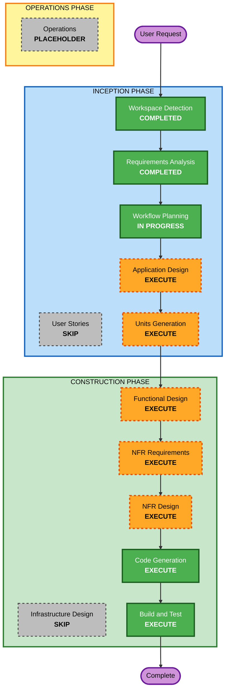

# Execution Plan

## Detailed Analysis Summary

### Project Type
**Greenfield** - New web-based Todo application with no existing codebase

### Change Impact Assessment
- **User-facing changes**: Yes - Complete web application with user interface for todo management, collaboration, and sharing
- **Structural changes**: Yes - New full-stack architecture with frontend, backend API, database, and email service
- **Data model changes**: Yes - New MongoDB schemas for users, lists, todos, collaborations, and share links
- **API changes**: Yes - New RESTful API with authentication, CRUD operations, sharing, and export endpoints
- **NFR impact**: Yes - Security (JWT auth, password hashing, RBAC), performance (API response times), email delivery

### Risk Assessment
- **Risk Level**: Medium
- **Complexity**: Moderate - Multiple integrated features (auth, CRUD, collaboration, file generation, email)
- **Rollback Complexity**: Easy - Greenfield project, no existing system to maintain
- **Testing Complexity**: Moderate - Requires unit tests, integration tests, and email/export functionality testing

---

## Workflow Visualization

---

## Phases to Execute

### INCEPTION PHASE
- [x] **Workspace Detection** - COMPLETED
  - Determined greenfield project with empty workspace
  
- [x] **Requirements Analysis** - COMPLETED
  - Gathered functional and non-functional requirements
  - Clarified authentication, collaboration, sharing, and export features
  
- [ ] **User Stories** - SKIP
  - **Rationale**: Requirements are clear and well-defined. User stories would add minimal value for this straightforward CRUD application with standard features. The requirements document already captures user scenarios adequately.
  
- [x] **Workflow Planning** - IN PROGRESS
  - Creating execution plan based on requirements
  
- [ ] **Application Design** - EXECUTE
  - **Rationale**: Need to define component architecture, identify services (auth, todo management, collaboration, export, email), and establish API structure for this multi-feature application
  
- [ ] **Units Generation** - EXECUTE
  - **Rationale**: Application should be decomposed into logical units (authentication module, todo CRUD module, collaboration module, export/sharing module, email service) for parallel development and better organization

### CONSTRUCTION PHASE

**Per-Unit Design Stages** (executed for each unit):

- [ ] **Functional Design** - EXECUTE
  - **Rationale**: Need detailed data models (User, List, Todo, Collaboration, ShareLink schemas), business logic for CRUD operations, role-based access control, and export generation
  
- [ ] **NFR Requirements** - EXECUTE
  - **Rationale**: Must address security (JWT, password hashing, RBAC), performance (API response times), and email delivery reliability
  
- [ ] **NFR Design** - EXECUTE
  - **Rationale**: Need to incorporate security patterns (JWT middleware, bcrypt hashing, role validation), error handling, and email retry logic
  
- [ ] **Infrastructure Design** - SKIP
  - **Rationale**: Local development environment only. No cloud infrastructure, containers, or deployment architecture needed at this stage

**Always Execute Stages**:

- [ ] **Code Generation** - EXECUTE (ALWAYS)
  - **Rationale**: Generate complete application code including frontend (Vanilla JS), backend (Express.js), database models (MongoDB/Mongoose), authentication, CRUD APIs, collaboration logic, PDF/Excel generation, email service, and share link functionality
  
- [ ] **Build and Test** - EXECUTE (ALWAYS)
  - **Rationale**: Provide build instructions, test execution guidance, and verification steps for all features

### OPERATIONS PHASE
- [ ] **Operations** - PLACEHOLDER
  - **Rationale**: Future deployment and monitoring workflows (not applicable for local development)

---

## Estimated Timeline

- **Total Stages to Execute**: 8 stages
  - INCEPTION: Application Design, Units Generation
  - CONSTRUCTION: Functional Design (per-unit), NFR Requirements (per-unit), NFR Design (per-unit), Code Generation (per-unit), Build and Test
  
- **Estimated Duration**: 
  - INCEPTION: 2 stages
  - CONSTRUCTION: 5-6 stages (depending on number of units)
  - Total: Comprehensive workflow with all necessary design and implementation stages

---

## Success Criteria

### Primary Goal
Deliver a fully functional web-based Todo application with authentication, CRUD operations, role-based collaboration, and sharing capabilities (PDF/Excel export via email and public links)

### Key Deliverables
1. User authentication system (registration, login, JWT-based sessions)
2. Todo list and item management (create, read, update, delete)
3. Role-based collaboration (Owner, Editor, Viewer roles)
4. Export functionality (PDF and Excel generation with full details)
5. Email sharing (send files as attachments via Gmail)
6. Public share links (read-only access without authentication)
7. Email reminder system (24-hour advance notifications for due dates)
8. Complete source code with proper structure
9. Build and test instructions
10. Setup documentation (MongoDB, Gmail App Password, environment variables)

### Quality Gates
- All CRUD operations work correctly
- Authentication and authorization enforce proper access control
- Role-based collaboration restricts actions based on user roles
- PDF and Excel exports contain complete todo information
- Email delivery works with Gmail SMTP
- Public share links provide read-only access
- Email reminders sent for upcoming due dates
- Code is well-structured, maintainable, and follows best practices
- Application runs locally without errors

---

## Technical Architecture Overview

### Frontend
- Vanilla JavaScript (no framework)
- HTML5 for structure
- CSS for styling (responsive design)
- Fetch API for backend communication

### Backend
- Node.js runtime
- Express.js framework
- RESTful API design
- JWT-based authentication middleware
- Role-based access control middleware

### Database
- MongoDB (NoSQL document database)
- Mongoose ODM for schema definition and validation
- Collections: users, lists, todos, collaborations, shareLinks

### External Services
- Gmail SMTP (via Nodemailer) for email delivery
- PDFKit or Puppeteer for PDF generation
- ExcelJS for Excel file generation

### Key Features
1. Authentication & Authorization
2. Todo CRUD Operations
3. List Management
4. Role-Based Collaboration
5. File Export (PDF/Excel)
6. Email Sharing
7. Public Link Sharing
8. Email Reminders (scheduled job)

---

## Next Steps

Upon approval, proceed to **Application Design** stage to:
1. Define component architecture
2. Identify services and their responsibilities
3. Design API endpoints and request/response structures
4. Establish data flow between components
5. Create high-level system architecture diagram
